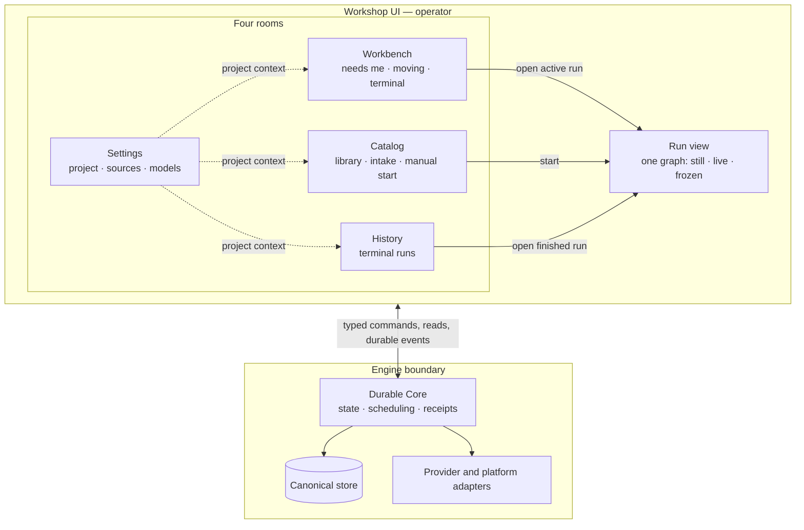

# Why this atelier exists

1. This is a derived view of the owner documents; if it disagrees with them, the owners win.[^1]

# The workshop

2. Atelier is a workshop rather than a dashboard, and the first thing in a room is the work or the quiet fact that nothing needs the operator.[^2]
3. Its rail contains Workbench, Catalog and History, with Settings set apart as the project context and the only project-switch seam.[^3]
4. Workbench owns what needs the operator, what is moving, the operator's own terminal and the unfolding queue, while a terminal run crosses once into History.[^4]
5. Catalog owns the library, provenance, intake, workflow approval and the single manual start door.[^5]
6. History contains only terminal runs and identifies each by when, purpose, work item, result and duration rather than by standing alone.[^6]
7. Settings owns connected sources, the provider model registry and the three project model defaults, while credential material is never shown or stored as ordinary application state.[^7]
8. A Run is a view rather than a room: one graph appears still before execution, live while work moves and frozen after completion, with detail in one node panel.[^8]
9. Rooms reuse Stage, Row, Card and Sheet; state is carried once by shape and colour, and at most one element moves on a screen.[^9]
10. Beneath the rooms, the engine owns immutable bindings, durable transitions, events and receipts, while the cockpit remains a projection and provider or platform specifics stay behind adapters.[^10]

## Operator sentences (Issue #1, 19.08.2026 amendment)

Source: [GitHub Issue #1](https://github.com/FlexOr2/atelier-2/issues/1).

> „Ich will Atelier 2 als neues, eigenständiges Produkt bauen: einen schlanken
> agentischen Orchestrator, in dem ich Abläufe als versionierte, deklarative
> Workflow-Graphen aus konfigurierbaren Nodes beschreibe. Das Produkt soll nicht
> GitHub, GitLab, CI, einen Agent-Paketmanager oder Wissensspeicher neu
> erfinden, sondern bestehende Plattformen hinter kleinen austauschbaren
> Grenzen verwenden."

> „Der Operator behält jederzeit die fachliche Kontrolle darüber, welcher
> Workflow verwendet wird."

[^1]: Owners: [ADR 0019 preamble](decisions/0019-workshop-target-picture.md), [Requirement 0003 Intent](requirements/0003-ziel-ui.md), [Product intent](product/intent.md)
[^2]: Owners: [HEART §The place](HEART.md)
[^3]: Owners: [ADR 0019 §1](decisions/0019-workshop-target-picture.md), [REQ-UI-20](requirements/0003-ziel-ui.md), [REQ-UI-23](requirements/0003-ziel-ui.md)
[^4]: Owners: [ADR 0019 §1](decisions/0019-workshop-target-picture.md), [HEART §The place](HEART.md), [REQ-UI-24](requirements/0003-ziel-ui.md)
[^5]: Owners: [ADR 0019 §1–§2](decisions/0019-workshop-target-picture.md), [REQ-UI-22](requirements/0003-ziel-ui.md), [REQ-UI-05](requirements/0003-ziel-ui.md)
[^6]: Owners: [ADR 0019 §1 and §4](decisions/0019-workshop-target-picture.md), [REQ-UI-13](requirements/0003-ziel-ui.md)
[^7]: Owners: [ADR 0019 §1 and §3](decisions/0019-workshop-target-picture.md), [REQ-UI-15](requirements/0003-ziel-ui.md), [ADR 0017 §1 and invariant 1](decisions/0017-account-credential-model.md)
[^8]: Owners: [ADR 0019 §1–§2](decisions/0019-workshop-target-picture.md), [REQ-UI-06](requirements/0003-ziel-ui.md)
[^9]: Owners: [ADR 0019 §2–§3](decisions/0019-workshop-target-picture.md), [REQ-UIQ-07](requirements/0003-ziel-ui.md), [HEART §One thing alive](HEART.md)
[^10]: Owners: [ADR 0001 §Decision and §Production boundary](decisions/0001-durable-runtime.md), [ADR 0003 §Decision](decisions/0003-http-api.md), [ADR 0004 §Decision](decisions/0004-local-cockpit.md), [Product runtime §Current state](product/runtime.md)
