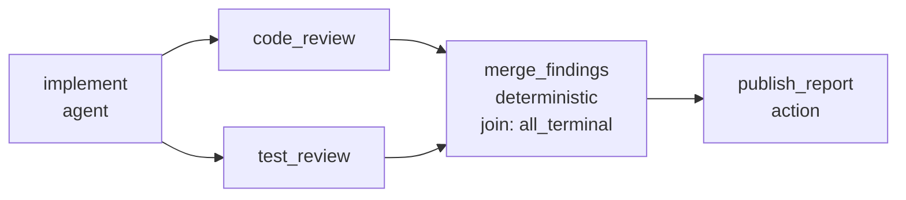

# ADR 0006: Format V3 is the whole authoring language; capabilities stage execution

- Status: ACCEPTED 2026-08-14 (Codex fifth exact-head review PASS, PR #30) — document
  surface implemented by PR #41
- Date: 2026-08-14, amended 2026-08-15 with "The document names itself" (the
  document-level `name` and `description`, decided while PR #41 was still draft
  because a field added to a closed hashed model after it lands is a format change),
  amended 2026-08-16 with the reference-form clarification below, clarified
  2026-08-20 by the operator on
  [agent-definition versus node-instruction ownership](https://github.com/FlexOr2/atelier-2/issues/6#issuecomment-5356860566)
  and
  [reusable workflow input](https://github.com/FlexOr2/atelier-2/issues/6#issuecomment-5356916897),
  and amended 2026-08-25 ([#658](https://github.com/FlexOr2/atelier-2/issues/658))
  on a loop repeating a `wait` node, and amended 2026-09-03
  ([#976](https://github.com/FlexOr2/atelier-2/issues/976)): the composed
  preview this record described does not exist, per the amendment beside "The
  conductor is a client, and one composed preview is the truth"
- Depends on: [ADR 0002](0002-exact-yaml-graph.md), [ADR 0001](0001-durable-runtime.md)
- Requirement authority: [Issue #1](https://github.com/FlexOr2/atelier-2/issues/1),
  whose "Deklaratives Kontext- und Artefaktrouting", "Parallele DAG-Ausführung"
  and "Operator besitzt den Workflow" sections this record expresses and never
  re-decides
- Feeds: [#6](https://github.com/FlexOr2/atelier-2/issues/6) (catalog, which owns
  the seed chain this record used to carry),
  [#7](https://github.com/FlexOr2/atelier-2/issues/7) (Dirigent)
- Names, never decides, the dependencies owned elsewhere:
  [#22](https://github.com/FlexOr2/atelier-2/issues/22) (catalog identity),
  [#24](https://github.com/FlexOr2/atelier-2/issues/24) (platform adapter),
  [#25](https://github.com/FlexOr2/atelier-2/issues/25) (bounded iteration),
  [#26](https://github.com/FlexOr2/atelier-2/issues/26) (budget),
  [#9](https://github.com/FlexOr2/atelier-2/issues/9) (interactive attach),
  #1 story 5 (context resolver)

Two version numbers meet here. **V1** is the product release Issue #1 decides.
**Format version 3** is the workflow document contract this record proposes, the
third after the V1 and V2 of [ADR 0002](0002-exact-yaml-graph.md). V3 is the
document surface that expresses the product's V1 contract.

## Context

An Agent node today carries a `role` and a one-line `job` string, and format V1's
Agent carries an exact expected output. Nothing else about the work is
expressible: no authored instruction, no statement of which earlier result a node
may read, no typed result, no statement of where a finished result lands, no
skills, no policy, no budget. The single Action node performs one hardcoded
effect, and execution is one successor chain — so no chain a real story needs is
expressible. #6 names that missing substrate exactly (node prompts, typed context
edges, output/handoff adapters, present in no schema and no decision record), #7's
Dirigent can only author what the format can express, and until this vocabulary
exists every catalog entry is a renamed toy chain.

Issue #1 decided the semantics on 2026-08-11/12 and #9 Rev. 4 decided that
execution mode is a capability declaration. This record re-decides none of it. It
decides the **document surface** that expresses it, completely and at once.

## Decision

### One author language, staged execution

Format version `3` is a new closed contract parsed by the existing safe-YAML
adapter, not an edit of V2. Every guarantee of ADR 0002 survives unchanged: exact
UTF-8 bytes identify the revision by SHA-256, the strict frozen model is validated
before any run or revision is written, unknown fields and node kinds, duplicate
keys, missing references, cycles, unreachable nodes, multiple documents, BOMs,
anchors, aliases, merges and explicit tags are refused, and declared edges own
execution order while list order means nothing.

V3 carries the **complete** authoring surface Issue #1 decided, including the
parts no runtime executes yet. What the current runtime can execute is not a
property of the format; it is a **published runtime capability revision** the run
binds at start. Validation therefore runs in three phases, and only the third
depends on what exists today:

1. **Document validity** — parse time, capability-independent. A valid V3 document
   is valid forever; a growing executor never changes what a stored revision
   means.
2. **Reference binding** — publish preview and run start. Every versioned
   reference must resolve to a published revision in the bound registries, and
   every mapping between a reference and its user must match, or the operation is
   refused naming the reference.
3. **Executability** — run start. Every capability the document requires must be
   attested by the bound runtime capability revision. A missing one refuses the
   **whole run** as `UNAVAILABLE`, naming the exact node and the exact missing
   capability. Never silently, never partially: a graph executed down to its first
   unsupported node would produce receipts for a shape nobody accepted.

Publishing a revision the current runtime cannot execute is permitted, and the
preview marks every such node with the capability it waits for. That is the point
of the record: revisions are immutable, so staging the *format* instead would force
a new format version and a re-authoring of every catalog entry each time a
capability lands. Staging execution costs one loud refusal instead.

### The document names itself

A revision is identified by its hash, and a hash answers no human's question about
which chain it is. Every surface that offers a stored revision — the catalog
picker, the composed preview, the run list — would otherwise have a SHA-256 to
show, and Issue #1's operator requirement is that a hash is never an option a human
chooses from. So the document carries its own operator-facing identity:

```yaml
format_version: 3
name: Self-build review chain
description: |
  Implements a story, reviews it from two sides, and publishes the merged verdict.
nodes: []
```

**`name` is required**, and the block is closed at exactly these two. An optional
name would leave the promise conditional: a surface listing revisions would still
need a hash to fall back on for the documents that carried none, and the operator's
sentence would hold for some chains and not others. Requiring it at parse is the
only place the guarantee is unconditional and needs no second guard downstream — a
document that does not name itself is refused `missing_field` at `name`, before it
can be stored, published or offered.

`name` is the one line a picker shows: bounded to 200 UTF-8 bytes, refused blank,
and refused when it carries any Unicode line boundary — not only `\n`, but `\r`,
VT, FF, the file/group/record separators, NEL, U+2028 and U+2029, each of which a
renderer may break at, so a name could hide a second line behind the one an
operator reads. `description` is the paragraph a detail view shows, optional and
bounded to 4 KiB. A third metadata field is an amendment to this record, never a
free key.

**The name is inside the revision and outside execution.** It is ordinary authored
bytes of the document, so [ADR 0002](0002-exact-yaml-graph.md)'s identity rule
already covers it unchanged: a rename is a **new revision** with a new hash,
exactly like a changed instruction. The alternative was considered and refused —
hashing a canonical form with the metadata stripped would let two documents share
one revision id, so the entry an operator picked *by name* would not be pinned to
the chain that runs, and a published name could be rewritten under a revision
somebody already approved. Immutability is worth more than a free rename; renaming
authors a successor, which is what every other authored change here already does.

Nothing executable may read it. There is no `document` input source form, so no
node can bind the name as a value; it contributes no capability requirement and
adds no element to `node-execution-request/v3`. That request's first element, the
workflow revision hash, covers it as bytes and never resolves it as a value: what a
chain is called must not be able to change what the chain does.

This is where a catalog display name comes from. #22 owns catalog identity,
lineage and storage and may index, present or override this name; what this record
decides is only that the document itself has an honest place to carry one, so a
picker has a name to show before any catalog row exists and without waiting for the
non-preserving store cutover.

### The node contract

Every node kind shares one shape. The kind decides what performs the work; the
shared fields decide what it may see, what it must produce, and what bounds it.

```yaml
- id: "<unique node id>"
  type: agent | deterministic | wait | subworkflow | action
  depends_on: ["<node id>"]
  join: all_succeeded | all_terminal
  required_context: []
  available_context: []
  inputs: []
  outputs: []
  budget: {ref: "<budget policy id>", revision: "<policy revision id>"}
  retry: {ref: "<retry policy id>", revision: "<policy revision id>"}
  cancellation: {ref: "<cancellation policy id>", revision: "<policy revision id>"}
```

`depends_on` replaces the `next` chain and is the only control edge. The initial
ready set is every node with no dependency; a node with no dependents is a **sink**,
and the sinks are the graph's exit set. "Terminal" in this record always means a
receipt, a disposition or the run state, never a node. There is no distinguished
node kind at either end and no `start` key: entry and exit sets are derived from the
edges, so a document cannot declare an order its edges contradict, and the terminal
run hash keeps covering the ordered event hashes.

`budget`, `retry` and `cancellation` are versioned references to published policy
revisions. The document pins **which** policy applies; the policy owner defines what
it means (budget units are #26). #1's invariants are not policy options: a run
cancel drives every running node to exactly one terminal cancel receipt,
already-started siblings drain, exhausted budget is a terminal failure receipt
rather than silent hanging, and a restart reconstructs the same ready set without
re-running a confirmed node.

`inputs` is the one construct by which any kind receives a value; there is no second
`arguments` construct. Each entry names one of exactly five sources:

```yaml
inputs:
  - name: story
    from: {graph_input: story}                    # exact material supplied at root-run start
  - name: candidate
    from: {node: implement, output: candidate}    # an upstream node's declared output
  - name: review_outcome
    from: {node: code_review, receipt: terminal}  # that node's terminal receipt
  - name: house_rules
    from: {context: house_rules}                  # a materialized required_context entry
  - name: label
    value: "needs-review"                         # authored bytes, inside the revision hash
```

A `node` source must lie in the transitive closure of `depends_on` and must name
an output that node declares; a data edge without the control edge that orders it
is refused at parse, so data flow can never imply an ordering the graph does not
state. Inputs may skip intermediate nodes, which is what makes a fix node
expressible: it reads the original candidate and each review's findings, and the
reviews are never merged into a shared chat.

### Dispositions, joins, and how a failure reaches every node

Two closed sets, and they are not the same set. Every node ends in exactly one
terminal receipt carrying one **persisted receipt disposition**, of which there
are exactly four:

| Disposition | Written when |
| --- | --- |
| `succeeded` | the node produced every declared output and each satisfied its bound schema revision |
| `failed` | the node ran and did not — provider or operation failure, schema violation, exhausted budget |
| `cancelled` | an attributed run cancel reached the node while it was running |
| `blocked` | the node never ran, because its join can no longer release |

What every reader downstream consumes is the **projected delivery status**: those
four values plus `stale`, five in all. `stale` exists only in the projection.
It is not a persisted disposition, no receipt writer accepts it, and a write
carrying it is refused as a fail-loud durable defect rather than stored — so
persisted `stale` is impossible by contract, not by convention. "Supersede writes
a marker" below owns the projection.

`blocked` is what makes a run with a failure terminate instead of hanging. It is
written, naming its reason and the exact dependency that caused it, when the
node's join is `all_succeeded` and any dependency's projected delivery status is
not `succeeded` (`dependency_failed`, `dependency_cancelled`, `dependency_stale`,
`dependency_blocked`), or when a run cancel arrives while the node has not
started (`run_cancelled`).

A `blocked` receipt spends no budget, opens no attempt and performs no external
effect. It is itself non-`succeeded`, so it propagates by the same rule to that
node's own dependents, and every node downstream of a failure reaches its one
terminal receipt. Siblings already running are never aborted by it: per #1 they
drain. The run is terminal when no node is running and every node holds exactly
one terminal receipt — a condition a restart reconstructs from the durable
receipts alone.

`join` is closed at exactly the two conditions #1 decided, because the requirement
authority closed them, not because today's scheduler is small. **Which nodes may
carry one is closed too**, so no scheduler infers a default:

- **no dependency** — `join` is refused at parse. There is nothing to join.
- **exactly one dependency** — `join` is optional, and its omission *is*
  `all_succeeded`: one edge means the dependent starts on a succeeded upstream.
  Writing `all_succeeded` out means the same and is accepted as the redundant
  spelling of the default.
- **more than one dependency** — `join` is required; a missing one is refused at
  parse naming the node.

One deliberate deviation from "author `join` only for fan-in": `all_terminal` stays
authorable over a single dependency, because it is the only way to say "run whatever
happened upstream" — the report node that must publish a failed gate, the
`from: {node, receipt: terminal}` input that needs its node to start at all.
Refusing it would make a one-edge failure path inexpressible while the two-edge one
is not.

**`all_succeeded`** starts the node only when every dependency is `succeeded`.
Every other case is the `blocked` receipt above.

**`all_terminal`** starts the node once every dependency holds a terminal receipt,
whatever its disposition, and the non-succeeded branch is **delivered rather than
lost**. Every input is therefore delivered inside a discriminated envelope:

- a referenced node that is `succeeded` and declared the output delivers
  `{status: succeeded, name, schema revision, hash, value}`;
- a referenced node with any other delivery status delivers
  `{status: <delivery status>, receipt: {node, persisted disposition, reason,
  receipt hash}}` — named, never a fabricated schema-bound value, never a silent
  absence, and the two fields differ exactly when the status is `stale`;
- `from: {node, receipt: terminal}` is always the second form, whatever the status.
  That is how a node that needs to know *how* a branch ended names it without also
  demanding an output.

The envelope is not conditional on the join. An input may name a transitive
ancestor that failed while the direct dependency succeeded, so every input carries
its status and no kind may assume the first form. Envelope status is part of the
request binding and of the node's own receipt, so a restart reconstructs the
identical delivery, and the authored instruction decides what to do with a failed
branch.

**Supersede writes a marker, never a second receipt.** A confirmed receipt is
immutable, so `stale` is never written into one and never arrives as a second
terminal receipt for the same node. #1's supersede command writes one immutable
`supersede-marker/v3` record naming the attributed actor and reason, the superseding
workflow or context revision, and — **enumerated in the marker itself** — the exact
receipt hashes and Context-Package hashes it covers. The command resolves the
covered revisions to those hashes once, at write time, because a hash does not
expose package membership: a marker naming a requirement revision could otherwise
be matched to receipts only by re-deriving what each package contained. Enumerating
the affected hashes is the durable answer and costs one list; a separate persisted
package-membership index would be a second durable structure to keep true. The
marker joins the run's ordered event hashes, so the terminal run hash covers it.

`stale` is therefore a **projected delivery status**, not a stored one. A node's
delivery status is its receipt's persisted disposition unless the marker enumerates
that receipt's hash or the Context-Package hash the receipt bound; then it projects
`stale` while the receipt keeps reading `succeeded` with its original hashes.
Everything downstream reads the projection: an unstarted `all_succeeded` dependent
writes its `blocked` receipt naming `dependency_stale`; an `all_terminal` dependent
receives the second envelope form with `status: stale`, naming both the receipt's
persisted disposition and the marker hash; a running sibling drains per #1; a node
already holding a confirmed receipt is never re-run by a marker. Projection is a
pure function of the durable receipts and markers, so a restart reconstructs the
identical delivery, and the run stays terminal on one terminal receipt per node.

### The five node kinds

Which field each kind requires (**R**), accepts (**O**), or refuses (**—**). A
refused field is a parse error, never an ignored one, and nothing here is left to
an implementer's default. `join` follows the three-way rule above for every kind
alike — refused with no dependency, optional with one, required with several.

| Field | agent | deterministic | wait | subworkflow | action |
| --- | --- | --- | --- | --- | --- |
| `id`, `type` | R | R | R | R | R |
| `depends_on`, `join` | O | O | O | O | O |
| `role`, `mode`, `instruction` | R | — | — | — | — |
| `difficulty`, `kind`, `family_differs_from`, `model` | O | — | — | — | — |
| `profile`, `skills`, `tools`, `policy` | O | — | — | — | — |
| `operation` | — | R | — | — | R |
| `workflow` | — | — | — | R | — |
| `prompt` | — | — | R | — | — |
| `required_context` | O | O | O | — | O |
| `available_context` | O | — | — | — | — |
| `inputs` | O | O | O | O — authored, unbound | one per operation parameter |
| `outputs` | O | R | exactly one | O — authored, unbound | O |
| `budget` | O | — | — | O | — |
| `retry` | O | O | — | — | — |
| `cancellation` | O | O | O | O | O |

The refusals in that table are decisions, not omissions. Only `agent` accepts
`available_context`, because only an agent can choose a read. `deterministic`
refuses `budget`: a pure computation buys no provider work, and a wall-clock bound
belongs to the operation revision, which knows its own cost. `retry` is refused by
`wait` because it is answered once, by `action` because a re-attempt of an effect is
reconciliation under ADR 0001, and by `subworkflow` because it is authored and
unexecutable: no V3 runtime owns retry for it.

#### `agent`

```yaml
- id: implement
  type: agent
  role: builder
  mode: headless
  difficulty: 2
  kind: build
  instruction: |
    Implement the bound story.
  profile: {ref: "<profile id>", revision: "<profile revision id>"}
  skills:
    - {ref: "<skill id>", revision: "<skill revision id>"}
  tools:
    - {ref: "<tool id>", revision: "<tool grant revision id>"}
  policy: {ref: "<policy id>", revision: "<policy revision id>"}
```

`instruction` replaces `job` and carries **only the work this node occurrence
performs in the workflow**. It is required, short and workflow-generic: every run
of the same revision receives the same instruction, while its concrete story or
other task material arrives through typed inputs. It is never a template field and
task bytes are never interpolated into it. The text sits inside the exact document
bytes, so it is inside the revision hash, immutable for a started run, and visible
in the composed preview. It is instruction, never context and never a secret; its
bound is 16 KiB of UTF-8, and an empty or oversized instruction is refused. Context
belongs in `required_context`, `available_context` and `inputs`, where it is
revision-bound, hashed and provenance-carrying; an instruction that pastes
requirement text instead is legal YAML and a review finding, not a format error.

`mode` is `headless`, `headless_with_tools` or `interactive` and is **always
explicit**, because mode decides what the invocation may touch and whether a human
could influence a result: `headless` is one text-in/text-out call,
`headless_with_tools` is a call whose process may also use the tools its bound
executor grants, and `interactive` puts an operator at the terminal, so its
downstream outputs count as operator-influenced (#9 part 2). Nothing that
consequential may be true by omission. Per #9 Rev. 4 the node declares the
requirement and the bound agent configuration declares the capability, and the two
must be equal: a run start, and a fork of a finished run, is refused before any
durable write when an agent node's declared mode is not exactly the capability its
bound agent-configuration revision declares, naming the node, its mode and that
capability. An `interactive` node either declares no
outputs, or declares every output `confirmed_by: operator`; an interactive output
mapped downstream without that confirmation is refused.

**Restart:** a node without a confirmed terminal receipt is re-armed as a new
attempt under the bound `retry` revision; a confirmed node is never re-run.
[ADR 0001](0001-durable-runtime.md) stays the owner of attempt ownership,
cancellation and cleanup — V3 adds no second attempt model.

#### `deterministic`

```yaml
- id: merge_findings
  type: deterministic
  depends_on: [code_review, test_review]
  join: all_terminal
  operation: {ref: merge_review_verdicts, revision: "<deterministic operation revision id>"}
  inputs:
    - name: code_findings
      from: {node: code_review, output: findings}
  outputs:
    - name: merged
      schema: {ref: review_verdict, revision: "<schema revision id>"}
```

`operation` binds a published **deterministic operation revision** in its own
registry, separate from the adapter operation registry because it has no external
effect: it is a pure function of its bound inputs, computed by the core with no
provider. Its declared parameter names must be matched exactly by the node's input
names, or binding is refused naming the parameter.

**Outputs bind exact-or-subset.** Every `outputs` entry must name an output the
bound operation revision declares and pin its identical schema revision; an
undeclared name, or a declared name under a different schema revision, is refused
at binding naming it. The author may project fewer outputs than the operation
produces, never more and never a renamed one — so nothing downstream of this record
invents an output name or picks which schema an output really satisfies.

**Restart:** the output hash is a pure function of the operation revision and the
ordered input hashes, so a restart recomputes rather than resumes. The terminal
receipt is written once under the node execution id; a recomputation disagreeing
with an already-written receipt is a fail-loud durable defect, never a silent
overwrite. Gated by `deterministic_operations`.

#### `wait`

```yaml
- id: approve_landing
  type: wait
  depends_on: [behaviour_test]
  prompt: |
    Approve landing this candidate, or reject it naming the blocking defect.
  inputs:
    - name: report
      from: {node: behaviour_test, output: report}
  outputs:
    - name: approval
      schema: {ref: landing_approval, revision: "<schema revision id>"}
```

This is #1's asynchronous, attributed approval gate, not a conversation: a Wait
carries no provider, no session and no history. Its single output's bound schema
revision **is** the answer contract, so V2's `answer_type: integer` is retired in
favour of a published schema. Answer bytes that violate it are refused as a
**command** error and the node stays waiting — a mistyped operator answer must not
become a node failure. `required_context` on a Wait is what the operator must see
to decide.

The V3 question is one bound object. With no `inputs`, it is exactly the authored
`prompt`, preserving earlier V3 behavior; V1/V2 keep their integer-answer form and
empty pause payload. With `inputs`, the runtime uses the Agent composition owner to
append each declared graph input or named predecessor output to that prompt and
records the exact composed question in the durable `WaitNodeBinding`. Authored
values, node receipts and context inputs remain refused by source form until a
composition owner carries them. Unknown graph inputs, nodes and outputs are still
refused by the graph contract before a run exists.

**Amendment 2026-08-25 ([#658](https://github.com/FlexOr2/atelier-2/issues/658)):**
"not a conversation" was a statement about a single Wait, and it still is — one
execution carries no provider, no session and no history of its own, and its
answer is still judged by the schema its single output pins. What changes is
that a declared loop may now repeat a Wait: each round asks under the round's
own identity (a `WaitNodeBinding` carries the round ordinal it was bound in,
and an answer is keyed by execution and round), so what reads as a conversation
across rounds is the loop's round identity carrying a sequence of otherwise
stateless, individually-judged answers — not a session the node itself keeps.

**Restart:** the run persists the waiting node and round. A bound-input pause's
`WAITING_INPUT` payload is its exact composed question; the event's payload hash
is the integrity check, never the carrier. A no-input or legacy pause keeps the
empty payload and its existing authored-prompt read path. Readback serves an
input-bearing question from that exact durable pause, so the question shown and
the pause answered remain one object even if a stored source later changes. The
answer is one attributed durable command keyed by run, node and answer bytes.
Identical concurrent
submissions converge on the same receipt and a different answer loses with a typed
conflict (ADR 0002's contract, unchanged). A restart re-enters the same wait
without a second prompt or a second acceptance; a run cancel drives it to one
`cancelled` receipt.

#### `subworkflow`

#449 withdrew the tests-only child closure, boundary binding, recursive capability
derivation, child preview and parent disposition. The authored form remains valid;
the real starter refuses it before durable writes.

A V3 document may declare graph-level inputs and outputs, which is what makes a
revision reusable as a child:

```yaml
format_version: 3
name: Review a candidate and return one verdict
graph_inputs:
  - name: candidate
    schema: {ref: workspace_candidate, revision: "<schema revision id>"}
graph_outputs:
  - name: verdict
    from: {node: merge_findings, output: merged}
nodes: []
```

```yaml
- id: review_panel
  type: subworkflow
  depends_on: [implement]
  workflow: {ref: review_panel, revision: "<workflow revision id>"}
  inputs:
    - name: candidate
      from: {node: implement, output: candidate}
  outputs:
    - name: verdict
      schema: {ref: review_verdict, revision: "<schema revision id>"}
```

#### `action`

Every landing of a result outside the run's own hashed outputs is an effect, so
every handoff is an Action node — never free code, never a side channel on an
Agent node.

```yaml
- id: publish_report
  type: action
  depends_on: [behaviour_test]
  operation: {ref: "<adapter operation id>", revision: "<operation revision id>"}
  inputs:
    - name: body
      from: {node: behaviour_test, output: report}
```

An Action binds one **versioned adapter-operation contract** that owns the
operation's parameters, addressing, authorization, readback and receipt shape; the
core knows only that the reference must resolve, that the operation declares an
effect class, and that the effect runs under #1's intent, readback and receipt
discipline. Optional `outputs` are the typed readback projection that contract
declares, binding exact-or-subset exactly as a deterministic operation's do: a
readback output the operation revision does not declare, or declares under another
schema revision, is refused at binding, and an author may project fewer, never more.
No platform identifier appears in this record or in the core — which operations a
platform offers, how it is addressed and authorized, and what its readback proves
are #24's, so a GitLab adapter is a new operation registry rather than a
workflow-format migration. The format sets **no limit** on the number of Action
nodes; how many effects per run execute is the `external_effects` attestation.

**The core derives the idempotency key; an author never writes one.** The key is
derived from the run id, the node id, the bound adapter operation revision and the
intent hash — the ordered hashes of the node's resolved inputs. Two nodes
therefore cannot collide on one logical name, an author cannot weaken the key by
choosing a coarse one, and a crash re-attempt of the same node with the same
materialized inputs is the same key and therefore the same effect. `logical_key`
is refused as a retired key.

**The adapter owns the proof; the core owns the envelope.** Typed readback evidence
belongs to the operation contract, because only the adapter knows what its platform
can prove; the core carries it in the receipt as an opaque hashed payload it never
interprets, and the adapter never writes the envelope.

**Restart:** ADR 0001's discipline, unchanged — intent, authoritative absence
check, effect, readback, receipt; an unknown outcome becomes a reconciliation an
accountable operator command resolves.

### Fork reuse is a reference, not another execution

For the executable linear V3 shape, a fork from node X reuses only the strict
prefix before X. Each reused coordinate points to the ultimate source run's node
execution, successful receipt, completion event, and declared Context-Package;
forking a fork flattens that reference rather than making a reference chain. The
successor stores no copied attempt, receipt, event, artifact, request, or package
for that prefix. When X consumes its predecessor output, the input loader follows
the validated reuse reference to the source artifact. New node-execution requests
and declared Context-Packages belong only to X and its successors.

An effect at or after X is not prefix reuse. Its confirmed origin receipt becomes
a cross-run fence. The successor may record a `FORK_REFERENCE` only when its
canonical request is identical and the referenced result hash is unchanged; a
mismatch waits for reconciliation before any adapter call. This is the same rule
whether `open-pr` is authored as an Action or invoked through an agent grant.

### Role, profile, skill: three different things

| Reference | What it carries | Who binds it | Can it make a run unstartable? |
| --- | --- | --- | --- |
| `role` | a logical name for who performs the work | the run-start command, to exactly one immutable agent-configuration revision (provider, model, auth profile) | yes — a role without exactly one bound configuration refuses the start |
| `profile` | reusable provider-neutral **task method** and house output conventions; never the worker's system identity | the document, revision-pinned | at binding like every versioned reference — an unresolved profile revision refuses. Never at executability: resolved text needs no execution capability |
| `skills` | published **capability bundles** an adapter installs into a provider session: a named procedure and the tool grants it needs | the document, revision-pinned, attested per adapter | at binding, and at executability too — a skill the bound adapter does not attest in `skill_installation`, or a tool grant it carries that is unattested in `tool_grants`, refuses the run naming it |

`role` keeps its V2 meaning: the document names the logical role and run start
resolves every graph role to at most one immutable agent-configuration revision.
The agent node may add `difficulty: 1 | 2 | 3` (absent means `2`),
`kind: build | review` (absent means `build`),
`family_differs_from: <declared role>`, and an exact `model` pin. Repeated nodes
for one role must declare the same values. A family rule may name neither its own
role nor an undeclared role. The workflow pin is the one intentional exception to
provider neutrality; [ADR 0018](0018-plugin-intake-and-neutral-roles.md) owns the
resolution precedence and project model configuration. Two nodes needing two
independently resolved configurations name two roles.

A Markdown **agent definition is deliberately absent from this reference table**.
It owns reusable worker identity and stable system behaviour; the node's
`instruction` owns only this occurrence's work, and a `profile` may share a task
method without becoming a second system prompt. The target binding is
`role → AgentConfigurationRevision → exact AgentDefinition revision`, with the
definition bytes owned by [ADR 0007](0007-catalog-identity.md). The document never
copies that prompt or pins the deployment configuration. Current implementation
stops at `AgentConfigurationRevision`; [PRODUCT.md](../PRODUCT.md) owns that status.

**A profile is not a skill.** Both refuse at binding when their revision does not
resolve; they differ at executability. A resolved profile is text, contributes no
capability requirement, and can therefore never be the reason a run refuses to
start; a skill carries tool grants an adapter must prove it installs and enforces,
so it can. The agent execution request carries the profile's bytes first and the
node's `instruction` second; where they conflict the node's sentence governs, and
both are inside the request binding and shown in the composed preview. A profile
carries no tools, no permissions, no provider and no model, and its own byte bound
belongs to the catalog artifact contract (#22) — the 16 KiB bound above is the
node's inline instruction inside the workflow document bytes.

That is the ownership split behind the whole node: **what the work is** is authored
and pinned in the document — instruction bytes, profile, skills, tools, policy,
budget, retry and cancellation — because those change the meaning of the work that
is judged and published; **who performs it** is deployment configuration bound at
run start. Anything reusable is a versioned reference, never copied inline; #22 owns
their naming, lineage and storage, this record only the reference form.

> `ref` is the stable derived lineage id of ADR 0007. The readable tokens in this
> record's examples are illustrative lineage ids, never display names; a display
> name never appears in document bytes.

### Context edges

Three reference kinds, one binding model. All are immutable, hashed and
revision-bound; per #1 they differ in provenance and in when they are fetched.

```yaml
required_context:
  - name: house_rules
    source: {ref: engineering_policy, revision: "<policy source revision id>", selector: required_rules}
available_context:
  - name: decision_records
    source: {ref: decision_record_index, revision: "<index revision id>"}
    read_operations:
      - {ref: search, revision: "<read operation revision id>"}
      - {ref: fetch_document, revision: "<read operation revision id>"}
```

`required_context` names sources materialized in full and hashed **before START**,
each naming the exact `selector` to materialize; a source that cannot be
materialized means the node does not START. A materialized entry is addressable as
`from: {context: <name>}` by that node's inputs.

Both the source and its revision are fixed authored bytes, not template
parameters. Material that should vary per run while the workflow revision stays
unchanged — a story, diff, order or brief — is a declared `graph_input`, supplied
as exact `RunInput` material at root-run start and read through
`from: {graph_input: <name>}`. Parameterizing a context-source binding would need
one explicit typed owner before it could be presented as executable syntax.

`available_context` is #1's on-demand grant, and per #1 it grants **both a source
and the read operations allowed on it**. A read the grant does not name is refused
by the resolver and produces a refusal access receipt — visible, never silent. Each
granted read operation revision owns its request shape and result typing; the core
owns the `ContextAccessReceipt`, binding source, source revision, read operation
revision, request hash and result hash. A grant naming no read operation is refused
at parse: a source with no permitted read is a decoration, not a grant.

Neither set of kinds is closed by this format. A source names a published
source-kind revision and a read a published read-operation revision in the
resolver's registry, so the resolver story adds kinds without a format version, and
an unresolvable reference is refused at binding naming it.

There is no ambient context: a node sees its instruction and profile, its skills,
its required and granted context, its inputs and its declared capabilities.
Conversation history and agent working memory are never passed to a successor, and
a summary never replaces its sources.

### Outputs bind versioned schemas

```yaml
outputs:
  - name: findings
    schema: {ref: review_verdict, revision: "<schema revision id>"}
```

An output is named, typed by a **versioned schema reference**, and hashed. The
format closes no list of kinds: `text`, a review verdict, and #1's workspace
candidate are the first published schema revisions rather than format vocabulary,
so a chain needing a new artifact shape publishes a schema instead of migrating
every stored document. Output bytes that do not satisfy the bound schema revision
are a terminal failure of the node, never a silent artifact. A schema derived from an
attempt's isolated workspace requires `isolated_workspace`, so a node declaring a
candidate refuses the run where that isolation is not provable — fail-closed
exactly like #1's auth modes.

### Capabilities are attested, never claimed

A runtime capability revision is **not authored and not editable**. The build and
adapter layer produces it as an attestation manifest: each entry names the exact
operations it proves executable, the build identity that proved them (source
revision plus the gate run), and the evidence reference. No command publishes a
hand-written capability revision and no workflow field grants one, so a deployment
cannot widen its own execution surface by editing a document — which is why
executability is a separate validation phase rather than a flag.

**A capability entry is a manifest, not a Boolean.** `external_effects` does not say
"Actions work"; it enumerates the adapter operation revisions proven executable,
each with its proven scope — the effect class, the reconciliation evidence covering
it, and the number of effects per run that crash evidence covers. An operation
absent from its manifest refuses the run naming it, exactly like a missing
capability.

**Root requirements are derived from supported references.** The capability set a
root document requires is computed from its node kinds and non-workflow
references:

- the agent-configuration revision a `role` binds contributes `agent_execution` for
  its executor identity and provider mode; `mode` itself stays that configuration's
  own declaration, compared against the node rather than attested twice;
- each bound `skills` revision contributes its `skill_installation` entry **and the
  `tool_grants` entry of every tool grant revision it carries**; each bound `tools`
  revision contributes its own `tool_grants` entry;
- a bound output schema materialized from an isolated workspace contributes
  `isolated_workspace`;
- a bound adapter operation contributes its `external_effects` entry, a bound
  deterministic operation its `deterministic_operations` entry;
- a `required_context` source contributes `context_materialization` and nothing
  else — never `context_resolution`, whose subject is the grant it does not carry;
- an `available_context` source contributes `context_resolution` together with every
  read operation revision it grants;

A refusal names the node, the reference through which the requirement entered, and
the missing capability.

**A skill's carried grants are requirements, not decoration.** A skill is a
capability bundle carrying tool grants, so each grant it carries must be attested
under `tool_grants` exactly as a node-level `tools` entry is — and the author never
restates it in node YAML, because a duplicated grant list is a second copy of the
skill's own contract and the two would drift. The two capabilities prove different
things and neither implies the other: `skill_installation` proves the adapter
installs the bundle, `tool_grants` proves each grant is enforced. So an **attested**
skill carrying an unattested grant refuses the whole run, naming the node, the skill
revision the grant entered through, that grant revision, and `tool_grants`.

Capability names are part of this contract, because a refusal must name something
stable:

| Capability | Attests |
| --- | --- |
| `dag_scheduling` | more than one dependency edge into or out of a node — fan-out, fan-in, joins, parallel ready sets (#1 story 3) |
| `agent_execution` | the enumerated agent-configuration and executor revisions the runtime proves it can invoke, each with its executor identity, provider mode, build identity and gate run. It never attests `mode`: per #9 Rev. 4 the bound configuration declares that, and one capability has exactly one declarer |
| `output_validation` | the enumerated output shapes the provider-neutral core proves it enforces, named as profiles rather than schemas — `single-json-output/v1` (#57) is the one such shape today. The document stays the sole declarer of `outputs[*].schema`; a node's declared output arity names the profile it needs, so a node declaring none or several names a shape no build attests yet instead of inheriting a builder default |
| `skill_installation` | the enumerated skill revisions the bound adapter proves it installs into a provider session, each with its proven scope — the procedure and the tool grants it carries — and its evidence reference |
| `tool_grants` | the enumerated tool grant revisions proven enforceable, each with the operations the grant permits and the evidence that proved the enforcement, not merely the installation |
| `context_materialization` | pre-START materialization of `required_context` with hash and provenance, by the materializer the run binds |
| `context_resolution` | `available_context` grants: the enforced source kinds and read operations, with `ContextAccessReceipt`s |
| `isolated_workspace` | an attempt's isolated hashed workspace, and any output schema derived from it |
| `external_effects` | the enumerated adapter operation revisions, each with its proven scope and per-run effect count |
| `deterministic_operations` | the enumerated deterministic operation revisions the core can compute |

Why `required_context` never contributes `context_resolution`: it is materialized by
whichever materializer the run binds — today #1's external bootstrap harness, later
story 5's privileged resolver — and both produce the same hashed,
provenance-carrying package, so `context_materialization`, which the bootstrap
attests, is the honest gate. Only `available_context` needs the resolver, because
only a resolver can enforce a grant and mint an access receipt; gating both behind
it would make every document unexecutable during exactly the bootstrap #1 planned
for.

`mode` is absent from the table for the opposite reason: #9 Rev. 4 gave every mode
a declarer already, the bound agent-configuration revision. One capability has
exactly one declarer, so mode is compared against that binding where the node's role
resolves to its configuration, and a node whose declared mode is not exactly the
capability that configuration declares refuses with the same loud, node-naming
shape, whichever of the three modes it declares.

Every subject a capability enumerates carries the identity space it lives in — the
registry kind beside the revision hash, the agent-configuration revision, or the
output profile — because identical bytes published as two kinds are two things, and
one `context_source` entry must never prove a `read_operation` of the same hash.

### What the run binds

A run start binds one published **run configuration revision** and records it in
the run snapshot, ordered by exact UTF-8 bytes and hashed with the run. It names,
as published immutable revision ids: the role matrix (role → agent-configuration
revision, and with it provider, model and auth profile), every profile, skill and
tool revision the document pinned, the policy, budget, retry and cancellation
revisions, the schema registry revision, the deterministic and adapter operation
registry revisions, the context source registry revision, and the runtime
capability revision.

Nothing a node call depends on may come from diffuse server-start state. Per #1
only small bootstrap, secret and hosting values belong to the server start;
everything that varies by project, provider, workflow, environment or runtime is a
published revision. A running run is never silently rebound, and a retry may not
change the matrix. Credentials are capabilities, never workflow fields, never
context, and never durable state.

### The conductor is a client, and one composed preview is the truth

The Dirigent of #7 is an ordinary author and API client: no node kind, no privileged
bypass, no hidden system node, no provider-dependent ceremony, no command the
operator does not also have. It publishes and starts through the same attributed
commands under the same publish gate (#6 Rev. 2: name the nearest existing catalog
entry and why it does not suffice), and the runtime executes only the visible
published revision.

Because it is a client, the operator must see exactly what it authored, and the
object that shows it is named: the **composed preview** is
`(workflow revision, run configuration, resolved registries)` —

- the exact revision bytes and the graph derived from them;
- the run configuration, marked **proposed** before a start command binds it and
  **bound** afterwards, field by field, so an author's intent is never mistaken for
  a binding;
- the resolved registries every reference lands in — schema, deterministic
  operation, adapter operation, context source, profile, skill, tool, the policy,
  budget, retry and cancellation registries, and the runtime capability
  attestation.

It is one typed API projection with its own hash, computed once and rendered alike
by the publish preview, the typed API and the cockpit. Per #1 it carries at least
nodes, edges and parallelism, roles with their bound provider and model, required
and available context with its granted reads, upstream inputs, skills, tools and
capabilities, budgets, retry and cancel, approval points and external effects —
plus, from this record, the capability each not-yet-executable node waits for.

**A V1 surface may collapse, never hide.** Good defaults may fold detail behind a
disclosure and a small screen may summarize first. Three things no surface may do:
omit a configurable field silently, present a configurable field as unrenderable,
or render one read-only. Every field this record defines as author-configurable is
renderable and editable in the composed preview; a surface that cannot render one
is a defect in that surface, not a permitted state. Equal projection is testable,
not a style guideline: the same revision and configuration yield the same composed
preview hash through all three surfaces.

**Editable means authorable, and a bound run is never edited.** While a run
configuration is marked *proposed*, an edit writes into that proposal, which no run
has bound. Once a start command marked it *bound*, the snapshot is immutable and an
edit cannot reach it: editing a bound preview **authors a proposed successor** — a
new workflow revision, a new run configuration revision, or both — a publishable
object of its own that reaches execution only through the visible
supersede/successor path, under the same attributed commands and publish gate. The
running run keeps executing exactly what it bound, its receipts stay immutable, and
the marker above is what tells its readers a successor exists. The no-read-only rule
loses nothing by this: the authoring surface stays fully editable, and what the
operator edits on a bound preview is a successor they can see rather than a snapshot
they silently rewrote.

**2026-09-03 amendment (operator delegation to the head as product owner, issue
[#976](https://github.com/FlexOr2/atelier-2/issues/976)): no composed preview
exists.** [#450](https://github.com/FlexOr2/atelier-2/issues/450)/[#977](https://github.com/FlexOr2/atelier-2/issues/977)
tore down the island this section describes: `application/compose_preview.py`,
`contracts/composed_preview_v3.py` and `contracts/capabilities_v3.py` reached no
entry point of the build, lived only through domain tests since #83, and were
deleted rather than wired. `docs/product/workflow.md` now reads, after a run
configuration revision is frozen, "[b]ehind that binding, nothing: the
registries are ports a caller supplies" — no route, rendering or stored shape
derives a preview from it. The Dirigent still publishes and starts as an
ordinary client under the same attributed commands and publish gate; what does
not survive is everything from "the object that shows it is named" onward — the
composed object itself, its per-surface equal-projection guarantee, and its
proposed/bound editing rule. **The first surface that draws a revision before it
runs owns that guarantee afresh**, built from the living publish and start
owners rather than from this section's assumption that a preview is already
there to extend.

### Refusals

Refused at parse, capability-independent: unknown field or node kind; a field the
node's kind refuses; duplicate node id, input name or output name; a cycle; an
unreachable node; a dependency on an unknown node; a data edge whose node is not
in the dependency closure; a data edge to an undeclared output; an input naming a
`context` entry the node does not declare; a missing `join` on a node with several
dependencies and a `join` on a node with none; an empty or oversized instruction;
an absent `mode`; an interactive node whose output is mapped downstream without
operator confirmation; an `available_context` grant naming no read operation; a
`wait` without exactly one output; a `graph_output` naming an undeclared node
output or sourcing a node that is not a sink; a malformed or unpinned versioned
reference; a document that does not name itself; a document `name` that is blank,
oversized or carries a Unicode line boundary; and an oversized `description`.

Refused at binding: any non-workflow versioned reference — profile, skill, tool,
policy, budget, retry, cancellation, schema, deterministic operation, adapter
operation, context source or read operation — that does not resolve to a published
revision; an operation whose declared parameters the node's inputs do not match
exactly; or a deterministic or Action output the bound operation revision does not
declare, or declares under a different schema revision.

Refused at run start: an ungranted adapter operation; a role without exactly one
bound agent-configuration revision; an unbound `graph_input`; an agent node whose
declared mode is not exactly the capability its bound agent-configuration revision
declares; and
any root requirement the bound runtime capability revision does not attest, naming
node, reference and capability.

A V3 document carrying `job`, `output`, `next`, `start`, `answer_type`,
`operands`, `arguments` or `logical_key` is refused with the retired key and its
replacement named, so an author who copied a V2 example learns what replaced it
instead of reading a generic closed-schema error.

### What binds a node call

`node-execution-request/v3` is a hash over an exact preimage, and the preimage is
this list — nothing omitted, nothing added, SHA-256, in this order.

**The encoding is the repository's existing one, not a second framing.** Every hash
here is taken over `atelier2.contracts.hashing.frame`: the `ATELIER2\0` prefix, the
length-prefixed domain naming the record, and each field carried under its own exact
byte length, exactly as `node-execution-id/v1` and `run-agent-bindings/v1` already
frame theirs. So delimiters are the length prefixes rather than separators and no
value can impersonate a boundary; an absent optional value is the zero-length field
in its declared position, so absence never shifts the frame; and a nested sequence is
one field holding its own frame under its own domain, which is how the ordered lists
below carry their members (`run-agent-binding/v1` inside `run-agent-bindings/v1` is
the shape). V3 adds domains — `node-execution-request/v3`, `node-receipt/v3`,
`context-package/v3`, `supersede-marker/v3` — and no new encoding rule.

1. the **workflow revision hash**, which already covers the instruction bytes, the
   node's own `budget`, `retry` and `cancellation` references and every other pinned
   reference;
2. the **run configuration revision id** — the one named bound snapshot, which is
   why this list stays short. Per "What the run binds" it names the role matrix,
   every profile, skill, tool and policy revision, the budget, retry and
   cancellation revisions, every registry revision, and the **runtime capability
   revision**; it is immutable and never rebound, so its id binds all of them;
3. the run id and the node id — the same pair under every attempt, so a retry is the
   same logical operation;
4. the **Context-Package hash** #1 requires — and it is the hash of the whole
   package, not of the `required_context` list alone. One versioned immutable
   `context-package/v3` manifest carries exactly the package Issue #1 enumerates,
   which this record references and never re-decides or extends: the selected
   requirement, epic and story material, the decisions and the ADR and owner
   contracts, the workflow and node revision, the skills, the capability and budget
   bounds, the source and target SHAs, the prior receipts, the provenance, and the
   stated reason for each inclusion and exclusion. The materialized
   `required_context` entries are **members** of that manifest, each
   `(name, source revision, selector, content hash)` in declared order and each
   addressable as `from: {context: <name>}`; the manifest is the container and is
   what the hash covers, so a re-ordered member, a swapped member and a changed
   non-member part of the package are each visible alike. It is written once,
   immutably, before START, and #1's STARTED event confirms this exact manifest
   hash;
5. the ordered `available_context` grants as `(name, source revision, read operation
   revisions)` — what the node *may* read is part of what it was asked to do;
6. the kind, and the `mode` where the kind has one;
7. the ordered input envelopes with their status, name, schema revision and hash;
8. the resolved agent-configuration, profile, skill, tool, policy, budget, retry and
   cancellation revision ids;
9. the declared output names with their schema revisions.

A changed context, a changed run configuration, a changed capability revision or a
changed bound policy is then a different logical operation rather than a silent
re-run of the same one, and a retry with identical inputs stays the same operation.

The node's terminal receipt is one envelope, owned by the core for every kind
(`node-receipt/v3`): the node execution id, the persisted disposition and its reason,
**the request hash and, separately and by name, the Context-Package hash that request
bound**, one ordered tuple of `(name, schema revision, hash)` for the declared
outputs, **and, where a schema judged the decoded bytes, that same schema revision
and the hash of those exact bytes as fields of this family** — older receipts
without those two fields remain readable — and — for an Action — the derived
idempotency key, the intent hash and the adapter's typed readback evidence as an
opaque hashed payload. The package hash is carried, never re-derived: a reader asks
"which context did this receipt run against?" without reconstructing the request
preimage, and a supersede marker matches a receipt when it enumerates that receipt's
hash or that package hash — the marker resolved membership at write time, so no
reader ever infers it from a hash. One receipt per node, not one per output: #1 gives
every node exactly one terminal receipt, and per-output receipts would make that
count ambiguous. That receipt change is the largest implementation cost of this
record and is named, not hidden.

The published V3 hash retains its literal empty `node-receipt-access/v3`
subframe as frozen byte identity, but exposes no Access field or store. A future
privileged Context Resolver owns a typed access receipt only with its first real
caller; it does not reuse the retired writerless surface.

## Worked example: the smallest cross-kind chain

One example, kept to what only a whole chain can show: declared fan-out, a fan-in
join, the difference between per-run material and fixed or granted context, a
deterministic merge of two review branches, and a landed effect. Every `revision`
value is a placeholder for a published revision id, the instructions are
illustrative workflow-generic text, and the shape is the decision. It is a format
example, not a claim that every authored form is executable by the current runtime;
[PRODUCT.md](../PRODUCT.md) owns that status. The per-kind YAML above owns `wait`
and `subworkflow`.

The full self-build chain this record used to carry is a **catalog seed, and #6
owns the catalog**: it now lives at
[issue #6, comment 5295735605](https://github.com/FlexOr2/atelier-2/issues/6#issuecomment-5295735605),
where a catalog entry can grow without re-opening a decision record.



```yaml
format_version: 3
name: Implement, review from two sides, publish the merged verdict
graph_inputs:
  - name: story
    schema: {ref: story, revision: "<schema revision id>"}
nodes:
  - id: implement
    type: agent
    role: builder
    mode: headless
    instruction: |
      Implement every literal acceptance sentence of the bound story inside your
      workspace, and return the candidate you produced.
    profile: {ref: builder_method, revision: "<profile revision id>"}
    skills:
      - {ref: workspace_discipline, revision: "<skill revision id>"}
    budget: {ref: build_budget, revision: "<budget revision id>"}
    required_context:
      - name: house_rules
        source: {ref: engineering_policy, revision: "<policy source revision id>", selector: required_rules}
    available_context:
      - name: decision_records
        source: {ref: decision_record_index, revision: "<index revision id>"}
        read_operations:
          - {ref: search, revision: "<read operation revision id>"}
    inputs:
      - name: story
        from: {graph_input: story}
    outputs:
      - name: candidate
        schema: {ref: workspace_candidate, revision: "<schema revision id>"}

  - id: code_review
    type: agent
    role: code_reviewer
    mode: headless
    instruction: |
      Name every defect in the candidate with its file and the sentence it violates.
    depends_on: [implement]
    inputs:
      - name: story
        from: {graph_input: story}
      - name: candidate
        from: {node: implement, output: candidate}
    outputs:
      - name: findings
        schema: {ref: review_verdict, revision: "<schema revision id>"}

  - id: test_review
    type: agent
    role: test_reviewer
    mode: headless
    instruction: |
      Name every acceptance sentence no behavioral test pins.
    depends_on: [implement]
    inputs:
      - name: story
        from: {graph_input: story}
      - name: candidate
        from: {node: implement, output: candidate}
    outputs:
      - name: findings
        schema: {ref: review_verdict, revision: "<schema revision id>"}

  - id: merge_findings
    type: deterministic
    depends_on: [code_review, test_review]
    join: all_terminal
    operation: {ref: merge_review_verdicts, revision: "<deterministic operation revision id>"}
    inputs:
      - name: code_findings
        from: {node: code_review, output: findings}
      - name: test_findings
        from: {node: test_review, output: findings}
    outputs:
      - name: merged
        schema: {ref: review_verdict, revision: "<schema revision id>"}

  - id: publish_report
    type: action
    depends_on: [merge_findings]
    operation: {ref: requirement_comment, revision: "<operation revision id>"}
    inputs:
      - name: body
        from: {node: merge_findings, output: merged}
```

The fan-out is declared, not implied: both reviews depend on `implement` alone, so
they are one ready set, and each omits `join` because one dependency means
`all_succeeded`. `merge_findings` has two, so its `join` is required, and
`all_terminal` is a decision with a stated consequence — a failed review arrives as
the receipt envelope rather than vanishing, and the merge still runs.
`publish_report` omits `join` again and so lands its effect only behind a
`succeeded` merge; had the author wanted the report published whatever happened,
`all_terminal` over that single dependency is the authored form. It declares no
`logical_key`, because the core derives the idempotency key, and the scheduler that
runs any of this is #1 story 3.

## Implementation status

[`docs/PRODUCT.md`](../PRODUCT.md) is the sole owner of what the current parser,
binder, runtime and store execute. This record owns the target contract and its
staging invariant: a valid authored form may be publishable before it is executable,
but a runtime must name and refuse every form it does not bind rather than ignore it.
No example in this record is an implementation-status inventory.

## Migration and the persistence cutover

V1 and V2 documents stay valid and keep their meaning. The parser dispatches on
`format_version` into a separate closed model, so V3 adds a version instead of
widening a frozen one, no stored revision is ever reparsed under a new meaning, and
a started run keeps executing under the version it bound. There is no runtime
**document** migration and none is needed.

The **store** is the other half, and a named predecessor rather than a detail.
`node-execution-request/v3`, `node-receipt/v3`, `context-package/v3`, the closed
**persisted receipt disposition** set — the four values, never `stale`, which is
projected and stores nothing — and the supersede marker replace today's durable V2
receipt and single-successor transition shape, while
[ADR 0001](0001-durable-runtime.md) creates schema V7 only in a truly empty
canonical store, reopens only an exact V7 product schema, rejects any other
store without mutation, and provides no runtime upgrade or downgrade migration. So:

- **A store schema revision carrying the V3 records is a required predecessor of V3
  execution.** It lands under ADR 0001's rule, not around it: a new exact schema
  version created in an empty store, older stores rejected unmutated. The cutover is
  therefore a deliberate operator-owned store replacement, and this record invents no
  in-place migration ADR 0001 forbids.
- **Publishing V3 documents may precede that cutover**, and only because it needs no
  new durable shape: a revision is stored as exact bytes with its hash, which V7
  already holds, and an unexecutable revision is exactly what the capability phase
  above expects. The moment a V3 run must write a receipt, the cutover is a hard
  predecessor with no partial path — a V3 run against a V7 store is refused, never
  written down in the old shape.

## Consequences

- A catalog entry can express a real chain — authored instruction, reusable
  profiles and skills, who sees what, parallel work, a deterministic join, bounds,
  and where a result lands. The substrate gap #6 names is closed at the document
  level.
- A picker never has to offer a hash, for any document without exception. Every
  parsed V3 document carries an operator-facing name, so every surface that lists
  revisions can show one without the catalog store and without a fallback path,
  and #22's display-name layer builds on a field that is always there instead of
  being the first place a name can live.
- A capability landing changes an attestation, not a format version. The cost is a
  second, published, build-produced artifact — the runtime capability revision —
  and the discipline that every refusal names a capability rather than a version.
  Publishable stays deliberately wider than executable, so an operator can be shown
  a graph the machine will refuse to start.
- The node execution request and receipt grow a version to carry named typed
  outputs, input envelopes with their delivery status, the bound Context-Package
  manifest hash and resolved revision ids. With the persisted-disposition set and
  the supersede marker that is a durable-contract change needing crash evidence and
  the store cutover above, not a field addition.
- V3 has no terminal child handling or binding: the real starter refuses a
  `subworkflow` before any durable write. A future executable slice would own the
  terminal and successor decisions it needs.
- The format expresses no conditional branching and no loop; per #1 there is no
  automatic fix-review cycle. Bounded iteration is #25's, and this record decides
  nothing about its author surface.

## Proof obligations

These are the record's proof obligations. [PRODUCT.md](../PRODUCT.md) owns which
capabilities and proofs exist today; this list does not restate that inventory.

- A V3 document parses to a closed frozen model, and every parse-time refusal
  above is proven by its own behavioral case, parametrized over the refusal list
  rather than copied per case — including each kind's refused fields.
- Every parsed document carries a `name` and may carry a `description`; a document
  that names itself nowhere is refused, a name carrying any Unicode line boundary
  is refused, each refused form above names its field; no node input can read the
  name as a value; and two documents differing only in their `name` have different
  revision hashes while their graphs are otherwise identical.
- A failed dependency terminates the whole graph: under `all_succeeded` the
  dependent gets a `blocked` receipt naming the dependency and its delivery status,
  that block propagates to its own dependents, running siblings still drain, and
  after restart every node holds exactly one terminal receipt.
- Under `all_terminal` a failed, cancelled and stale branch each arrive as the
  documented receipt envelope while a succeeded input arrives as the value
  envelope, and a restart reconstructs the identical delivery.
- The join rule is proven in all three positions: `join` on a node with no
  dependency is refused at parse; a single-dependency node with no `join` produces
  exactly the delivery and the `blocked` receipt an authored `all_succeeded`
  produces; a single-dependency `all_terminal` node starts on a failed upstream and
  receives its receipt envelope.
- A supersede marker over a confirmed receipt writes no second terminal receipt and
  leaves that receipt's persisted disposition, output hashes and bytes unchanged,
  while the projection turns `stale`: an unstarted `all_succeeded` dependent blocks
  naming `dependency_stale`, an `all_terminal` one receives `status: stale` with the
  marker hash, and a confirmed node is not re-run.
- Persisted `stale` is impossible: a receipt write carrying it is refused as a
  durable defect, and no stored receipt in any of the cases above holds it.
- A marker naming a context revision covers exactly the receipts whose enumerated
  Context-Package hashes it lists — a receipt bound to a package the marker does not
  enumerate keeps its `succeeded` projection — and the whole projection is
  reconstructed identically after a process restart from the durable receipts and
  markers alone, with no membership index consulted and no package re-derived.
- Result mapping refuses instead of inventing: a deterministic or Action `outputs`
  entry the bound operation revision does not declare, and one declared under a
  different schema revision, are each refused at binding naming the output, while a
  declared subset binds; a root `graph_output` sourcing a non-sink node is refused
  at parse.
- Executability is proven separately from validity: the same valid document is
  accepted at publish, marked in the preview, and refused at run start naming the
  exact node and missing capability; it starts unchanged once the capability
  revision attests that capability; and a capability entering only through a schema
  reference is refused with that reference named.
- Every root non-workflow versioned reference kind refuses an unresolvable revision
  at binding, naming it.
- Two Action nodes with identical inputs in one run receive distinct derived
  idempotency keys, and a crash re-attempt of one node receives the same key and
  produces exactly one effect and one receipt.
- An unattested skill revision, tool grant revision and agent-configuration
  executor each refuse the run naming node, reference and capability; a document
  whose only context is `required_context` starts against a capability revision
  attesting `context_materialization` alone, without `context_resolution`.
- The nested case is proven too: a skill revision attested in `skill_installation`
  whose carried tool grant revision is unattested in `tool_grants` refuses the run,
  naming the node, the skill, that grant and `tool_grants` — and the same document
  starts unchanged once the carried grant is attested, with no `tools` entry added
  to the node.
- The worked example above parses, publishes, and round-trips byte-identically,
  and the V1/V2 example documents from the existing suites still parse unchanged.
- The request and receipt hash vectors are literal and pinned, computed over
  `atelier2.contracts.hashing.frame` and reproduced by no other framing, one per
  dimension of the preimage: changing the workflow revision, the run configuration
  revision, the runtime capability revision, a bound budget, retry or cancellation
  revision, a `required_context` member of the Context-Package manifest, a
  non-member part of that manifest, an input envelope's status, or a declared
  output's schema revision — each alone — yields a different request identity, while
  an identical retry yields the identical one; and a receipt vector binds its request
  hash and its Context-Package hash independently readable.
- One revision rendered through publish preview, API projection and cockpit yields
  the same composed preview hash, and every author-configurable field is present
  and editable in each while the configuration is proposed. Editing a **bound**
  preview yields a new proposed revision and leaves the run's snapshot, its
  receipts and its composed preview hash unchanged.
  **2026-09-03 amendment (operator delegation to the head as product owner, issue
  [#976](https://github.com/FlexOr2/atelier-2/issues/976)): retired.** The
  composed preview this bullet proves reached no entry point of the build and was
  deleted rather than wired
  ([#450](https://github.com/FlexOr2/atelier-2/issues/450)/[#977](https://github.com/FlexOr2/atelier-2/issues/977));
  its former proof, `tests/domain/test_composed_preview_v3.py`, is retired with
  it. See the amendment on "The conductor is a client, and one composed preview
  is the truth" above for where today's truth lives.
- A V3 run against a store without the V3 record schema is refused whole, with
  nothing written in the old shape.

## Out of scope

This record decides a document surface, its bindings and its refusals — and nothing
about the engine or executor implementation; the scheduler, ready set and
parallelism (#1 story 3); catalog entries, identity, naming, lineage and storage
(#6, #22); the bounded iteration construct and any surface it may need (#25); any
platform adapter's operations, addressing and authorization (#24); budget units
(#26); interactive attach, transcripts and remote runners (#9 parts 2 and 3); or the
privileged context resolver with its access receipts (#1 story 5).

## Amendment 2026-08-31 — the V1 and V2 document grammar is deleted

This record described V1 and V2 as living document formats beside V3: "V1/V2
keep their integer-answer form and empty pause payload" (Decision), "V1 and V2
documents stay valid and keep their meaning" (Implementation status), and "the
V1/V2 example documents from the existing suites still parse unchanged" (Proof
obligations). All three are withdrawn.

#901 slice 5 (#934) deleted the V1/V2 document grammar: `parse_workflow_document`
refuses `format_version: 1` and `format_version: 2` by name, and
`WORKFLOW_DOCUMENT_FORMATS` (`contracts/workflow_documents.py`) lists only V3. The
parser admits format 3 only. `AnyWorkflowDocument` is `WorkflowGraphV3`; no
format branch beside it remains reachable in the code this record governs.

Durable/historical representation is unchanged by this amendment: the frozen
migration `CHECK`s in `adapters/dbos/schema.py`, the `Run`/`RunV2`/`RunV3`
binding-shape axis, and `WorkflowFormatVersion`'s V1/V2 members for rows the
frozen schema still reads all stay exactly as this record and ADR 0003 already
describe them. What ends is a document declaring format 1 or 2 ever being
*read* again — the grammar, not the historical value.

## Supersedes

None. This record extends [ADR 0002](0002-exact-yaml-graph.md), which remains the
owner of the document, graph, identity and transition contracts for every format
version.
